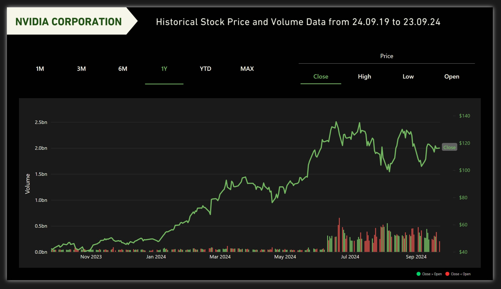

# NVIDIA Stock Chart

See the full dashboard here - [App Power BI Link](https://app.powerbi.com/view?r=eyJrIjoiNzYzNDdhYjAtNmYyMC00NGJlLTlhYzktYWNkYTA3NzcwZDE0IiwidCI6IjZhNDE0M2RmLTkyN2UtNGU5Yy04YTNmLTlmYzZiMGU4ZDVmYiJ9)

## License
This project is licensed under the Creative Commons Attribution 4.0 International License. Feel free to share and adapt, but please credit me as the creator!
# Project Title: NVIDIA Corporation Historical Stock Price and Volume Data Visualization in Power BI

## Project Goal
This project involved creating a historical stock price and volume data chart for NVIDIA Corporation using Power BI. The goal was to build an interactive chart displaying trends in NVIDIA’s stock performance over a five-year period while refining data visualization techniques learned from a London Business Analytics Group tutorial series.

## Process Overview

1. **Data Selection & Acquisition**
   - Selected NVIDIA Corporation for analysis to align with current market trends, diverging from the M&G company used in the tutorial. Since Yahoo Finance required a paid account for historical data, NVIDIA stock data was downloaded via Google Sheets instead.
   - Imported this data into Power BI, noting the absence of ‘Adjusted Close’ prices in the dataset, likely due to limitations with Google Finance data. Consequently, the analysis focused on available closing prices.

2. **Data Preparation**
   - In Power Query, data transformation steps were carried out, particularly focusing on date formatting and filtering.

3. **Chart Creation & Measure Development**
   - Created a chart in Power BI following the tutorial and developed DAX measures to ensure accurate data representation. Additional customizations were implemented based on community feedback to enhance functionality.

4. **Design & Visualization Refinement**
   - Redesigned the chart and entire page, customizing the color palette and overall style. Removed unnecessary elements to achieve a clean, polished, and professional look. NVIDIA’s logo was omitted to comply with trademark guidelines.

## Conclusion
This project effectively visualized NVIDIA’s stock data from September 24, 2019, to September 23, 2024, creating a solid foundation for stock trend analysis. Future projects could build on this by adding dynamic data updates and comparisons with other stocks to expand functionality and provide deeper insights.
